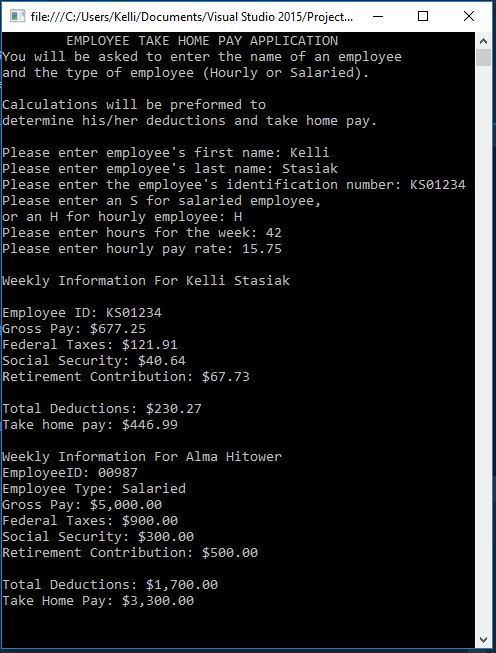

# Take-Home-Pay
C# Application

## Assignment Details
Write a program that calculates the take-home pay for an employee. The two types of employees are salaried and hourly. Allow the user to input the employee's first and last name, it, and type. If an employee is salaried, allow the user to input the salary amount. If an employee is hourly, allow the user to input the hourly rate and the number of hours clocked for the week. For hourly employees, overtime is paid for hours over 40 at a rate of 1.5 of the base rate. For all employee;s take-home pay, federal tax of 18% is deducted. A retirement contribution of 10% and a Social Security tax rate of 6% should also be deducted. Use appropriate constants. Design an object-oriented solution. Create a second class to test your design.

## Output

